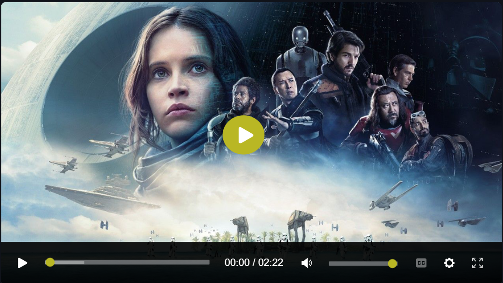

<div align="center">

# 🎬 Sopplayer

**The Ultra-Lightweight, Accessible & Zero-Dependency HTML5 Video Player**

[](https://github.com/SH20RAJ/Sopplayer/releases)
[](https://cdn.jsdelivr.net/gh/SH20RAJ/Sopplayer@v2.0.0/dist/sopplayer.min.js)
[](https://cdn.jsdelivr.net/gh/SH20RAJ/Sopplayer@v2.0.0/dist/sopplayer.min.js)
[-818cf8.svg?style=flat-square)](https://github.com/SH20RAJ/Sopplayer/blob/main/package.json)
[](https://sh20raj.github.io/Sopplayer/demo/accessibility/)
[](./LICENSE)
[](https://www.jsdelivr.com/package/gh/SH20RAJ/Sopplayer)
[](https://github.com/SH20RAJ/Sopplayer/actions)

<p align="center">
  <a href="https://sh20raj.github.io/Sopplayer/"><strong>Live Showcase</strong></a> &bull;
  <a href="https://sh20raj.github.io/Sopplayer/demo/"><strong>Interactive Playground</strong></a> &bull;
  <a href="https://sh20raj.github.io/Sopplayer/players/"><strong>Theme Gallery</strong></a> &bull;
  <a href="https://sh20raj.github.io/Sopplayer/demo/accessibility/"><strong>A11y Lab</strong></a> &bull;
  <a href="./docs/"><strong>Documentation</strong></a>
</p>

<p align="center">
  
</p>

</div>

---

## 🧭 Navigation

- [⚡ Why Sopplayer?](#-why-sopplayer)
- [📊 Comparison Matrix](#-comparison-matrix)
- [🚀 Quickstart](#-quickstart)
  - [1. Versioned CDN](#1-versioned-cdn-recommended-for-production)
  - [2. NPM / Modern Bundlers](#2-npm--modern-bundlers)
  - [3. React / Next.js](#3-react--nextjs)
  - [4. Vue 3](#4-vue-3)
  - [5. Svelte](#5-svelte)
  - [6. Declarative HTML5 Drop-in](#6-declarative-html5-drop-in)
- [🎨 Theming & CSS Custom Properties](#-theming--css-custom-properties)
- [⌨️ Keyboard Shortcuts](#️-keyboard-shortcuts)
- [📖 API Reference](#-api-reference)
  - [Constructor Options](#constructor-options)
  - [Instance Methods](#instance-methods)
  - [Lifecycle Events](#lifecycle-events)
- [♿ Accessibility (WCAG 2.1 AA)](#-accessibility-wcag-21-aa)
- [🔄 Backwards Compatibility & Migration](#-backwards-compatibility--migration)
- [🔒 Security & Hardening](#-security--hardening)
- [🛠️ Development & Testing](#️-development--testing)
- [👥 Contributing](#-contributing)
- [📜 License](#-license)

---

## ⚡ Why Sopplayer?

Sopplayer is a next-generation HTML5 video player built specifically for web developers who want exceptional media playback without the baggage of heavy frameworks, complex build chains, or security hazards.

- 🪶 **Zero Runtime Dependencies**: Written in pure, modular JavaScript. Minified bundle size is **under 40 KB** (and ~11 KB gzipped) — **95% smaller** than legacy Video.js stacks.
- ♿ **Audited WCAG 2.1 AA Accessibility**: Engineered with accessible semantics: ARIA progress sliders (`role="slider"`), auditory screen reader announcements (`aria-live="polite"`), high-contrast visible focus outlines, and full `prefers-reduced-motion` compliance.
- ⌨️ **Comprehensive Keyboard Navigation**: Control playback (<kbd>Space</kbd>/<kbd>K</kbd>), seeking (<kbd>&larr;</kbd>/<kbd>&rarr;</kbd>, <kbd>J</kbd>/<kbd>L</kbd>, <kbd>0</kbd>&ndash;<kbd>9</kbd>), volume (<kbd>&uarr;</kbd>/<kbd>&darr;</kbd>, <kbd>M</kbd>), fullscreen (<kbd>F</kbd>), Picture-in-Picture (<kbd>P</kbd>), and shortcuts cheat sheet (<kbd>?</kbd>).
- 🎨 **Modern Design System & 7 Built-in Themes**: Driven entirely by CSS Custom Properties. Includes `Default` (Obsidian Glass), `Flamingo` (Coral / Rose), `Forest` (Emerald), `City` (Urban Ruby), `Sea` (Azure), `Fantasy` (Neon Cyberpunk), and `Minimal` (Monochrome).
- 🔒 **Secure by Default**: Completely eliminated unsafe `innerHTML` concatenation with untrusted URLs, sanitizes media protocols against `javascript:` pseudo-protocol injection, and isolates error handling across event loops.
- 🔄 **100% Backwards Compatible**: Existing CDN URLs (`cdn.jsdelivr.net/gh/SH20RAJ/Sopplayer/...`), legacy `<video class="sopplayer" data-setup="...">` tags, and Video.js 7.x API wrappers continue working seamlessly.

---

## 📊 Comparison Matrix

| Feature | Sopplayer v2.0 | Video.js 8.x | Plyr 3.7 | Clappr |
| :--- | :---: | :---: | :---: | :---: |
| **Bundle Size (minified)** | **< 40 KB** | ~ 460 KB | ~ 125 KB | ~ 320 KB |
| **Bundle Size (gzipped)** | **~ 11 KB** | ~ 125 KB | ~ 38 KB | ~ 85 KB |
| **Runtime Dependencies** | **0** | 14+ | 2 | 5+ |
| **Built-in Themes** | **7 Themes** | 0 (Plugins) | 1 Theme | 0 (Custom CSS) |
| **WCAG 2.1 AA Audited** | **Built-in** | Yes | Partial | Partial |
| **Auditory Live Region** | **Yes (`aria-live`)** | Plugins | No | No |
| **Keyboard Shortcuts Cheat Sheet** | **Built-in (`?`)** | No | No | No |
| **Video.js v1 API Compatibility** | **Built-in Adapter** | N/A | No | No |
| **TypeScript Definitions** | **Included (`.d.ts`)** | `@types/video.js` | Included | Community |

---

## 🚀 Quickstart

### 1. Versioned CDN (Recommended for Production)

Use immutable, versioned URLs (`@v2.0.0`) to guarantee stability in production:

```html
<!DOCTYPE html>
<html lang="en">
<head>
  <meta charset="UTF-8">
  <meta name="viewport" content="width=device-width, initial-scale=1.0">
  <title>Sopplayer Demo</title>

  <!-- Sopplayer Modern CSS -->
  <link rel="stylesheet" href="https://cdn.jsdelivr.net/gh/SH20RAJ/Sopplayer@v2.0.0/dist/sopplayer.min.css">
</head>
<body>

  <video id="my-video" poster="poster.jpg" preload="metadata" width="720">
    <source src="video.mp4" type="video/mp4">
    <track kind="subtitles" label="English" srclang="en" src="subtitles.vtt" default>
    <p>Your browser does not support HTML5 video.</p>
  </video>

  <!-- Sopplayer Modern JavaScript -->
  <script src="https://cdn.jsdelivr.net/gh/SH20RAJ/Sopplayer@v2.0.0/dist/sopplayer.min.js"></script>
  <script>
    const player = new Sopplayer('#my-video', {
      theme: 'default', // 'flamingo' | 'forest' | 'city' | 'sea' | 'fantasy' | 'minimal'
      aspectRatio: '16:9',
      keyboard: true
    });
  </script>

</body>
</html>
```

---

### 2. NPM / Modern Bundlers

Install Sopplayer into your modern JavaScript or TypeScript build pipeline:

```bash
npm install sopplayer
# or
pnpm add sopplayer
# or
yarn add sopplayer
```

```javascript
import { Sopplayer } from 'sopplayer';
import 'sopplayer/css';

const player = new Sopplayer('#my-video', {
  theme: 'flamingo',
  seekStep: 5,
  autoplay: false
});

player.on('play', () => console.log('Playback started!'));
```

---

### 3. React / Next.js

```jsx
import { useEffect, useRef } from 'react';
import { Sopplayer } from 'sopplayer';
import 'sopplayer/css';

export function VideoPlayer({ src, poster, theme = 'default' }) {
  const videoRef = useRef(null);
  const playerRef = useRef(null);

  useEffect(() => {
    if (videoRef.current) {
      playerRef.current = new Sopplayer(videoRef.current, {
        theme,
        aspectRatio: '16:9',
        keyboard: true
      });
    }

    return () => {
      playerRef.current?.destroy();
    };
  }, [src, theme]);

  return (
    <div className="video-wrapper">
      <video ref={videoRef} poster={poster} preload="metadata" playsInline>
        <source src={src} type="video/mp4" />
      </video>
    </div>
  );
}
```

---

### 4. Vue 3

```vue
<template>
  <div class="video-container">
    <video ref="videoEl" :poster="poster" preload="metadata" playsinline>
      <source :src="src" type="video/mp4" />
    </video>
  </div>
</template>

<script setup>
import { ref, onMounted, onBeforeUnmount } from 'vue';
import { Sopplayer } from 'sopplayer';
import 'sopplayer/css';

const props = defineProps({
  src: { type: String, required: true },
  poster: { type: String, default: '' },
  theme: { type: String, default: 'default' }
});

const videoEl = ref(null);
let playerInstance = null;

onMounted(() => {
  if (videoEl.value) {
    playerInstance = new Sopplayer(videoEl.value, {
      theme: props.theme,
      aspectRatio: '16:9'
    });
  }
});

onBeforeUnmount(() => {
  playerInstance?.destroy();
});
</script>
```

---

### 5. Svelte

```svelte
<script>
  import { onMount, onDestroy } from 'svelte';
  import { Sopplayer } from 'sopplayer';
  import 'sopplayer/css';

  export let src;
  export let poster = '';
  export let theme = 'default';

  let videoElement;
  let player;

  onMount(() => {
    player = new Sopplayer(videoElement, { theme });
  });

  onDestroy(() => {
    player?.destroy();
  });
</script>

<video bind:this={videoElement} {poster} preload="metadata" playsinline>
  <source {src} type="video/mp4" />
</video>
```

---

### 6. Declarative HTML5 Drop-in

For CMS sites, WordPress, Webflow, or static pages where you prefer zero JavaScript configuration:

```html
<!-- Load stylesheets and script once in head -->
<link rel="stylesheet" href="https://cdn.jsdelivr.net/gh/SH20RAJ/Sopplayer@v2.0.0/dist/sopplayer.min.css">
<script src="https://cdn.jsdelivr.net/gh/SH20RAJ/Sopplayer@v2.0.0/dist/sopplayer.min.js"></script>

<!-- Add class="sopplayer" to any video tag -->
<video class="sopplayer" data-setup='{"theme":"forest","autoplay":false}' poster="thumbnail.jpg" width="720">
  <source src="video.mp4" type="video/mp4">
</video>
```

---

## 🎨 Theming & CSS Custom Properties

Sopplayer features 7 out-of-the-box themes designed with glassmorphic aesthetics and high-contrast accessibility:

| Theme | Accent Color | Visual Identity | Target Use Case |
| :--- | :---: | :--- | :--- |
| **`default`** | `#38bdf8` (Sky Blue) | Obsidian Glass & Subtle Cyan Glow | General purpose, SaaS, Portfolios |
| **`flamingo`** | `#f43f5e` (Rose Coral) | Sunset Crimson & Warm Tones | Creative portfolios, Lifestyle |
| **`forest`** | `#10b981` (Emerald) | Moss Green & Organic Glass | Nature, Education, Documentaries |
| **`city`** | `#e11d48` (Urban Ruby) | Neon Red & Slate Darkroom | Action, Nightlife, Urban media |
| **`sea`** | `#0ea5e9` (Ocean Blue) | Deep Aqua & Oceanic Gradients | Travel, Science, Clean Tech |
| **`fantasy`** | `#a855f7` (Cyber Violet) | Neon Purple & Futuristic Cyberpunk | Gaming, Synthwave, Sci-Fi |
| **`minimal`** | `#f8fafc` (Pure White) | High-contrast Monochrome | Editorial, Minimalist blogs, News |

### Custom Styling via CSS Variables

Override any token directly in your application CSS:

```css
:root {
  --sp-primary: #f59e0b;              /* Brand accent color */
  --sp-primary-hover: #d97706;        /* Accent hover state */
  --sp-bg-glass: rgba(15, 23, 42, 0.85); /* Control bar background */
  --sp-progress-bg: rgba(255, 255, 255, 0.2); /* Track rail background */
  --sp-border-radius: 8px;            /* Control buttons radius */
  --sp-focus-ring: 0 0 0 3px rgba(245, 158, 11, 0.5); /* A11y focus outline */
}
```

---

## ⌨️ Keyboard Shortcuts

Sopplayer includes intuitive, YouTube/Vimeo standard keyboard navigation out-of-the-box:

| Key Shortcut | Action | Auditory Screen Reader Announcement |
| :--- | :--- | :--- |
| <kbd>Space</kbd> or <kbd>K</kbd> | Toggle Play / Pause | *"Playing"* / *"Paused"* |
| <kbd>&larr;</kbd> / <kbd>&rarr;</kbd> | Seek backward / forward 5 seconds | *"Seeked to MM:SS"* |
| <kbd>J</kbd> / <kbd>L</kbd> | Seek backward / forward 10 seconds | *"Seeked to MM:SS"* |
| <kbd>&uarr;</kbd> / <kbd>&darr;</kbd> | Volume up / down 10% | *"Volume X%"* |
| <kbd>M</kbd> | Toggle Mute | *"Muted"* / *"Unmuted, volume X%"* |
| <kbd>F</kbd> | Toggle Fullscreen | *"Entered fullscreen"* / *"Exited fullscreen"* |
| <kbd>P</kbd> | Toggle Picture-in-Picture | *"Entered Picture-in-Picture"* |
| <kbd>C</kbd> | Toggle Subtitles / Captions | *"Captions on / off"* |
| <kbd>0</kbd>&ndash;<kbd>9</kbd> | Seek to 0% &ndash; 90% of duration | *"Seeked to MM:SS"* |
| <kbd>&lt;</kbd> / <kbd>&gt;</kbd> | Decrease / increase playback rate | *"Speed Xx"* |
| <kbd>?</kbd> | Open / close Keyboard Shortcuts cheat sheet | Modal focus dialog |

---

## 📖 API Reference

### Constructor Options

```javascript
const player = new Sopplayer(target, options);
```

| Option | Type | Default | Description |
| :--- | :--- | :--- | :--- |
| `theme` | `string` | `'default'` | `'default'`, `'flamingo'`, `'forest'`, `'city'`, `'sea'`, `'fantasy'`, `'minimal'` |
| `aspectRatio` | `string` | `'16:9'` | CSS aspect-ratio container constraint (e.g., `'16:9'`, `'4:3'`, `'1:1'`) |
| `autoplay` | `boolean` | `false` | Automatically begin playback on mount (subject to browser policies) |
| `controls` | `boolean` | `true` | Whether to display the interactive bottom control toolbar |
| `volume` | `number` | `1.0` | Initial volume level between `0.0` and `1.0` |
| `muted` | `boolean` | `false` | Initial muted state |
| `loop` | `boolean` | `false` | Loop media playback indefinitely |
| `playbackRates` | `number[]` | `[0.5, 0.75, 1, 1.25, 1.5, 2]` | Available speed options in settings menu |
| `keyboard` | `boolean` | `true` | Enable keyboard shortcut listeners |
| `seekStep` | `number` | `5` | Arrow key seek interval in seconds |
| `captionsDefault` | `boolean` | `true` | Auto-enable first available `<track>` caption track |

---

### Instance Methods

| Method | Parameters | Returns | Description |
| :--- | :--- | :--- | :--- |
| `play()` | None | `Promise<void>` | Begins media playback |
| `pause()` | None | `void` | Pauses media playback |
| `togglePlay()` | None | `void` | Toggles play/pause state |
| `currentTime(time?)` | `number` *(optional)* | `number` | Gets or sets the playback position in seconds |
| `duration()` | None | `number` | Returns the media duration in seconds |
| `volume(vol?)` | `number` *(optional)* | `number` | Gets or sets volume between `0.0` and `1.0` |
| `muted(state?)` | `boolean` *(optional)* | `boolean` | Gets or sets the audio mute state |
| `playbackRate(rate?)` | `number` *(optional)* | `number` | Gets or sets the playback speed multiplier |
| `setTheme(themeName)` | `string` | `void` | Dynamically updates the active player theme skin |
| `toggleFullscreen()` | None | `Promise<void>` | Toggles browser fullscreen mode |
| `togglePip()` | None | `Promise<void>` | Toggles Picture-in-Picture window |
| `on(event, callback)` | `string, Function` | `void` | Subscribes an event listener callback |
| `once(event, callback)` | `string, Function` | `void` | Subscribes an event listener that fires only once |
| `off(event, callback)` | `string, Function` | `void` | Unsubscribes an event listener |
| `destroy()` | None | `void` | Teardown DOM listeners, timers, and restores native video |

---

### Lifecycle Events

```javascript
player.on('timeupdate', (data) => {
  console.log(`Current: ${data.currentTime} / ${data.duration}`);
});
```

| Event | Payload | Description |
| :--- | :--- | :--- |
| `play` | `{ currentTime }` | Fired when playback starts |
| `pause` | `{ currentTime }` | Fired when playback pauses |
| `timeupdate` | `{ currentTime, duration, progress }` | Fired periodically as playhead advances |
| `volumechange` | `{ volume, muted }` | Fired when volume or mute state changes |
| `ratechange` | `{ playbackRate }` | Fired when playback speed is adjusted |
| `fullscreenchange` | `{ isFullscreen }` | Fired on fullscreen enter or exit |
| `enterpictureinpicture` | `{ window }` | Fired on PiP enter |
| `leavepictureinpicture` | `{}` | Fired on PiP exit |
| `themechange` | `{ theme }` | Fired when `setTheme()` changes skin |
| `ended` | `{ duration }` | Fired when media playback finishes |
| `error` | `{ error }` | Fired on media decode or network error |

---

## ♿ Accessibility (WCAG 2.1 AA)

Accessibility is a core design constraint in Sopplayer, not an afterthought:

1. **Screen Reader Live Region**: A hidden `aria-live="polite"` element announces player state changes (play, pause, volume, time jumps) so visually impaired users are fully informed without screen clutter.
2. **Keyboard Focus Management**: Every interactive button has visible `:focus-visible` styling with a 3px contrast outline. Modal dialogs trap focus and restore it upon dismissal (<kbd>Escape</kbd>).
3. **Slider Semantics**: Progress bar and volume controls use `role="slider"` with `aria-valuenow`, `aria-valuemin`, `aria-valuemax`, and `aria-valuetext`.
4. **Motion Preference**: Full support for `@media (prefers-reduced-motion: reduce)` disabling control transition animations for sensitive users.

---

## 🔄 Backwards Compatibility & Migration

If you are using legacy Sopplayer v1.x, **your existing integrations continue to work with zero breaking changes**:

### Legacy CDN Endpoints (Fully Supported)
- `https://cdn.jsdelivr.net/gh/SH20RAJ/Sopplayer/sopplayer.min.js`
- `https://cdn.jsdelivr.net/gh/SH20RAJ/Sopplayer/sopplayer.min.css`
- `https://cdn.jsdelivr.net/gh/SH20RAJ/Sopplayer/flamingo/sp-flamingo.min.js`
- `https://cdn.jsdelivr.net/gh/SH20RAJ/Sopplayer/dtube/dtube.min.js`
- `https://cdn.jsdelivr.net/gh/SH20RAJ/Sopplayer/Default/videojs.css`

### Video.js v1 API Compatibility
Legacy Video.js style code continues functioning via our built-in compatibility proxy:

```javascript
// Legacy Video.js code works without modification:
var player = videojs('my-video');
player.ready(function() {
  player.play();
  console.log('Video.js API shim initialized successfully');
});
```

To upgrade to the modern v2 architecture, simply switch your CDN URL from unversioned to `@v2.0.0` and call `new Sopplayer(...)`. See the full [Migration Guide](./docs/migration.md).

---

## 🔒 Security & Hardening

Sopplayer v2 underwent a comprehensive security audit:
- **Zero DOM XSS**: Eliminated all vulnerable `innerHTML` operations with user-supplied URL queries or track parameters.
- **Protocol Sanitization**: Media sources and poster URLs are strictly validated to block `javascript:` and `data:text/html` injection vectors.
- **Safe Base64 Handlers**: Safe base64 decoding wraps URL parsing to prevent uncaught exceptions on malformed strings.
- Read the full [Security Policy](./SECURITY.md).

---

## 🛠️ Development & Testing

```bash
# Clone repository
git clone https://github.com/SH20RAJ/Sopplayer.git
cd Sopplayer

# Install dev dependencies
npm install

# Run automated unit, security, and integration test suites
npm test

# Run code linter
npm run lint

# Build modern distribution bundles
npm run build

# Start local zero-dependency development server
npm run dev
```

---

## 👥 Contributing

Contributions are warmly welcomed! Please read our [Contributing Guide](./CONTRIBUTING.md) and [Code of Conduct](./CODE_OF_CONDUCT.md) before submitting pull requests.

---

## 📜 License

Sopplayer is open-source software licensed under the [MIT License](./LICENSE).

---

<div align="center">
  <p>Built with ❤️ by <a href="https://sh20raj.github.io/"><strong>Shaswat Raj</strong></a> (@SH20RAJ)</p>
  <p>If you find Sopplayer useful, please give it a ⭐️ on <a href="https://github.com/SH20RAJ/Sopplayer">GitHub</a>!</p>
</div>
